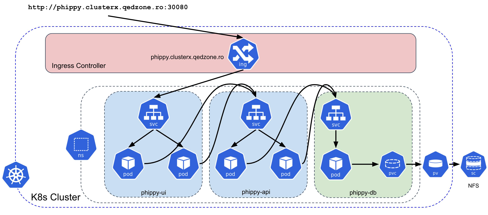
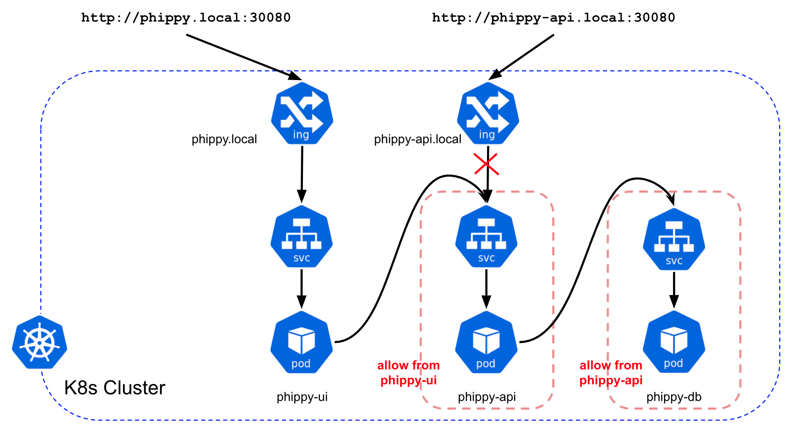

# Phippy

Simple tutorial to build and deploy a Python App in Kubernetes.

## Phippy Deployment Overview in K8s



## Phippy Isolation with Network Policies



## Build and Test with Docker-Compose

```bash
make build
make push
docker compose up
```

Access the [http://localhost:8080](http://localhost:8080).  


## Deploy the app to Kubernetes

```bash
kubectl apply -f kubernetes/

kubectl get pods
kubectl get svc
```

Access the [http://phippy.local](http://phippy.local:30080).
